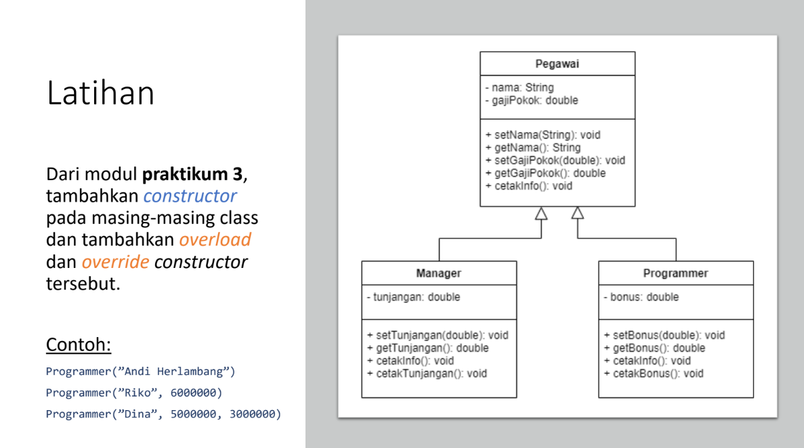
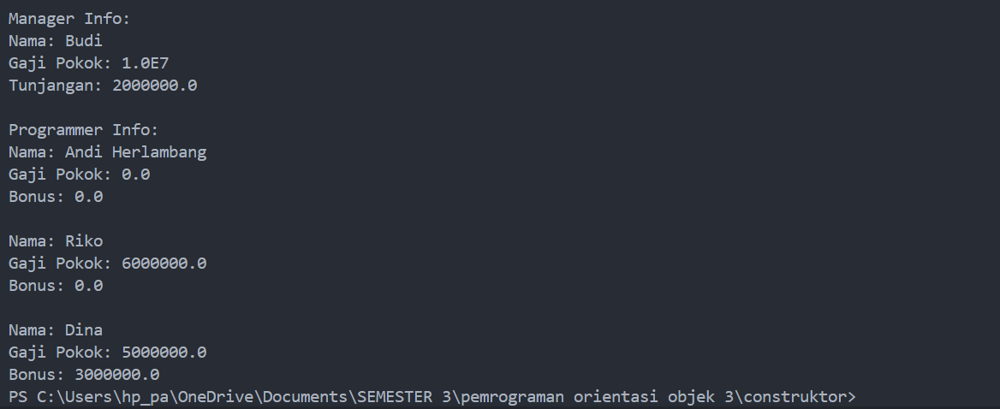
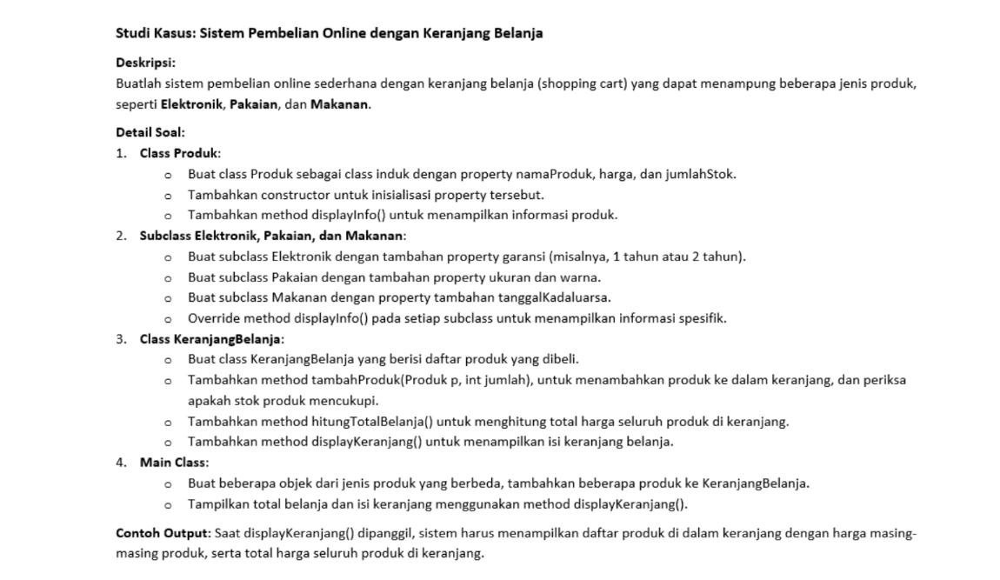
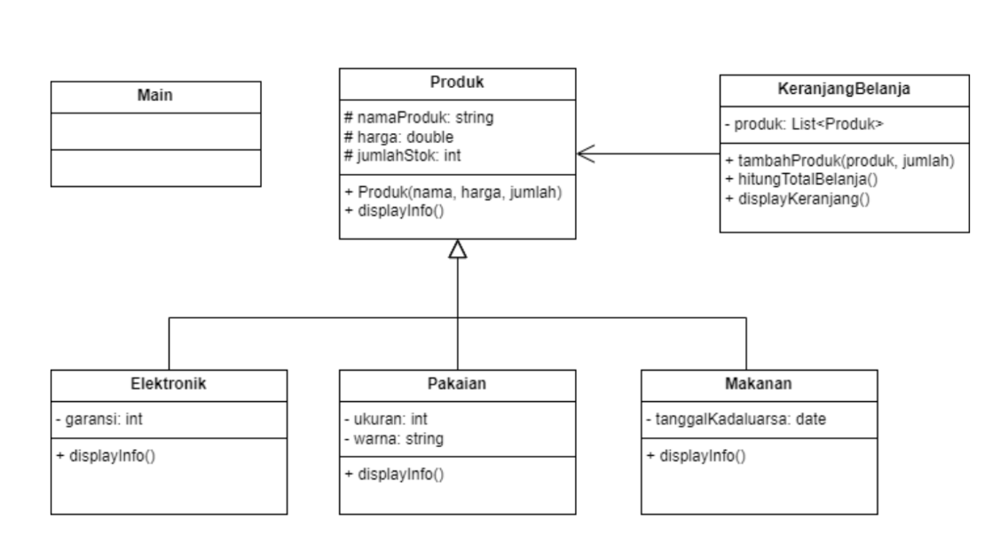
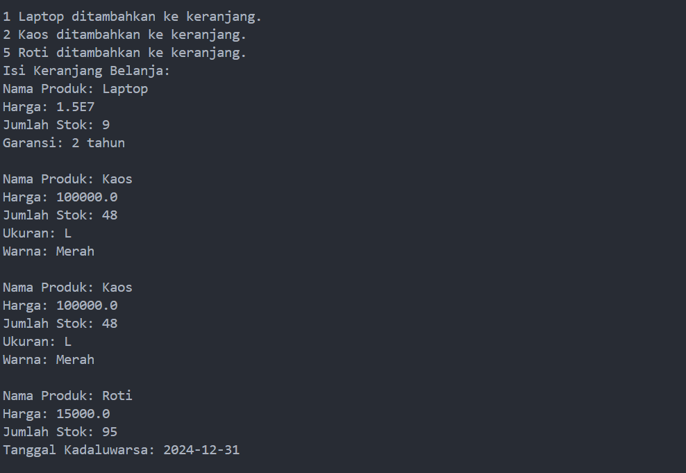

# Latihan
```
NIM    :312310632
NAMA   :FAKHRI AFIF
KELAS  :TI.23.A6
MATKUL:Pemrograman orientasi objek 3
```

## pegawai

```
class Pegawai {
    protected String nama;
    protected double gajiPokok;

    // Constructor with no parameters
    public Pegawai() {
        this.nama = "";
        this.gajiPokok = 0.0;
    }

    // Constructor with name parameter
    public Pegawai(String nama) {
        this.nama = nama;
        this.gajiPokok = 0.0;
    }

    // Constructor with name and gajiPokok
    public Pegawai(String nama, double gajiPokok) {
        this.nama = nama;
        this.gajiPokok = gajiPokok;
    }

    public void setNama(String nama) {
        this.nama = nama;
    }

    public String getNama() {
        return nama;
    }

    public void setGajiPokok(double gajiPokok) {
        this.gajiPokok = gajiPokok;
    }

    public double getGajiPokok() {
        return gajiPokok;
    }

    public void cetakInfo() {
        System.out.println("Nama: " + nama);
        System.out.println("Gaji Pokok: " + gajiPokok);
    }
}
```
## Manager
```
class Manager extends Pegawai {
    private double tunjangan;

    // Constructor with no parameters
    public Manager() {
        super();
        this.tunjangan = 0.0;
    }

    // Constructor with name and gajiPokok
    public Manager(String nama, double gajiPokok) {
        super(nama, gajiPokok);
        this.tunjangan = 0.0;
    }

    // Constructor with name, gajiPokok, and tunjangan
    public Manager(String nama, double gajiPokok, double tunjangan) {
        super(nama, gajiPokok);
        this.tunjangan = tunjangan;
    }

    public void setTunjangan(double tunjangan) {
        this.tunjangan = tunjangan;
    }

    public double getTunjangan() {
        return tunjangan;
    }

    @Override
    public void cetakInfo() {
        super.cetakInfo();
        System.out.println("Tunjangan: " + tunjangan);
    }
}
```
## Programer
```
class Programmer extends Pegawai {
    private double bonus;

    // Constructor with name only
    public Programmer(String nama) {
        super(nama);
        this.bonus = 0.0;
    }

    // Constructor with name and gajiPokok
    public Programmer(String nama, double gajiPokok) {
        super(nama, gajiPokok);
        this.bonus = 0.0;
    }

    // Constructor with name, gajiPokok, and bonus
    public Programmer(String nama, double gajiPokok, double bonus) {
        super(nama, gajiPokok);
        this.bonus = bonus;
    }

    public void setBonus(double bonus) {
        this.bonus = bonus;
    }

    public double getBonus() {
        return bonus;
    }

    @Override
    public void cetakInfo() {
        super.cetakInfo();
        System.out.println("Bonus: " + bonus);
    }
}
```
## Main
```
public class Main {
    public static void main(String[] args) {
        // Creating Manager object
        Manager man1 = new Manager("Budi", 10000000, 2000000);
        
        // Creating Programmer objects with different constructors
        Programmer prog1 = new Programmer("Andi Herlambang");
        Programmer prog2 = new Programmer("Riko", 6000000);
        Programmer prog3 = new Programmer("Dina", 5000000, 3000000);

        // Displaying info for Manager
        System.out.println("Manager Info:");
        man1.cetakInfo();
        System.out.println();

        // Displaying info for each Programmer object
        System.out.println("Programmer Info:");
        prog1.cetakInfo();
        System.out.println();
        prog2.cetakInfo();
        System.out.println();
        prog3.cetakInfo();
    }
}
```
## Hasil outputnya


## Studi kasus:sistem pembelian online dengan keranjang Belanja
 
## produk
```
class Produk {
    protected String namaProduk;
    protected double harga;
    protected int jumlahStok;

    // Constructor
    public Produk(String namaProduk, double harga, int jumlahStok) {
        this.namaProduk = namaProduk;
        this.harga = harga;
        this.jumlahStok = jumlahStok;
    }

    // Display product information
    public void displayInfo() {
        System.out.println("Nama Produk: " + namaProduk);
        System.out.println("Harga: " + harga);
        System.out.println("Jumlah Stok: " + jumlahStok);
    }
}
```
## Elektronik
```
class Elektronik extends Produk {
    private String garansi; // Example: "1 tahun" or "2 tahun"

    // Constructor
    public Elektronik(String namaProduk, double harga, int jumlahStok, String garansi) {
        super(namaProduk, harga, jumlahStok);
        this.garansi = garansi;
    }

    // Override displayInfo
    @Override
    public void displayInfo() {
        super.displayInfo();
        System.out.println("Garansi: " + garansi);
    }
}
```
### pakaian
```
class Pakaian extends Produk {
    private String ukuran; // Example: "M", "L", "XL"
    private String warna;  // Example: "Merah", "Biru"

    // Constructor
    public Pakaian(String namaProduk, double harga, int jumlahStok, String ukuran, String warna) {
        super(namaProduk, harga, jumlahStok);
        this.ukuran = ukuran;
        this.warna = warna;
    }

    // Override displayInfo
    @Override
    public void displayInfo() {
        super.displayInfo();
        System.out.println("Ukuran: " + ukuran);
        System.out.println("Warna: " + warna);
    }
}
```
## Makanan
```
import java.time.LocalDate;

class Makanan extends Produk {
    private LocalDate tanggalKadaluwarsa;

    // Constructor
    public Makanan(String namaProduk, double harga, int jumlahStok, LocalDate tanggalKadaluwarsa) {
        super(namaProduk, harga, jumlahStok);
        this.tanggalKadaluwarsa = tanggalKadaluwarsa;
    }

    // Override displayInfo
    @Override
    public void displayInfo() {
        super.displayInfo();
        System.out.println("Tanggal Kadaluwarsa: " + tanggalKadaluwarsa);
    }
}
```
## keranjang Belanja
```
import java.util.ArrayList;

class KeranjangBelanja {
    private ArrayList<Produk> daftarProduk;

    // Constructor
    public KeranjangBelanja() {
        this.daftarProduk = new ArrayList<>();
    }

    // Method to add products to the cart
    public void tambahProduk(Produk p, int jumlah) {
        if (p.jumlahStok >= jumlah) {
            p.jumlahStok -= jumlah;
            for (int i = 0; i < jumlah; i++) {
                daftarProduk.add(p);
            }
            System.out.println(jumlah + " " + p.namaProduk + " ditambahkan ke keranjang.");
        } else {
            System.out.println("Stok " + p.namaProduk + " tidak mencukupi.");
        }
    }

    // Calculate total price of products in cart
    public double hitungTotalBelanja() {
        double total = 0;
        for (Produk p : daftarProduk) {
            total += p.harga;
        }
        return total;
    }

    // Display cart content
    public void displayKeranjang() {
        System.out.println("Isi Keranjang Belanja:");
        for (Produk p : daftarProduk) {
            p.displayInfo();
            System.out.println();
        }
        System.out.println("Total Belanja: " + hitungTotalBelanja());
    }
}
```
## Main
```
import java.time.LocalDate;

public class Main {
    public static void main(String[] args) {
        // Create some products
        Elektronik laptop = new Elektronik("Laptop", 15000000, 10, "2 tahun");
        Pakaian kaos = new Pakaian("Kaos", 100000, 50, "L", "Merah");
        Makanan roti = new Makanan("Roti", 15000, 100, LocalDate.of(2024, 12, 31));

        // Create shopping cart
        KeranjangBelanja keranjang = new KeranjangBelanja();

        // Add products to the cart
        keranjang.tambahProduk(laptop, 1);
        keranjang.tambahProduk(kaos, 2);
        keranjang.tambahProduk(roti, 5);

        // Display cart contents and total price
        keranjang.displayKeranjang();
    }
}
```
## Hasil Outputnya



